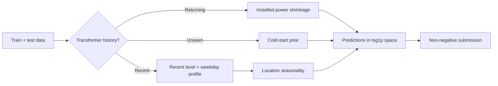

<div align="center">

# ⚡ Grid Up Datathon 2026

**Transformer-level electricity demand forecasting with a reproducible, RMSLE-first pipeline.**

`Python` · `pandas` · `NumPy` · `CatBoost`

</div>

> **Best recorded public RMSLE: 1.10604** — a 0.13629 improvement over the
> season-aware baseline.

The challenge is to forecast daily electricity consumption (`tuketim`) for
individual transformers from April through July 2026. Because the competition
metric is RMSLE, the pipeline learns, averages, and blends predictions in
`log1p(tuketim)` space.

## What makes this solution work

- **Recent behavior:** blends each transformer's latest consumption level with
  its historical weekday pattern.
- **Seasonality:** adds a location-level April–July curve learned from
  transformers with complete history.
- **Returning assets:** treats transformers that reappear after a long gap as
  recommissioned assets and shrinks stale history toward an installed-power
  prior.
- **Cold starts:** predicts unseen transformers from installed power and early
  asset-life behavior.
- **Safe output:** clips negative predictions and preserves the sample
  submission's exact row order.



## Results

Public leaderboard results recorded on August 31, 2026:

| Model | Public RMSLE | Kaggle reference |
| --- | ---: | ---: |
| Recent 3 days + weekday + power-age cold start | 1.26688 | 55669847 |
| Recent 7 days + weekday + power-age cold start | 1.25594 | 55669854 |
| Season-aware blend + power cold start | 1.24233 | 55670171 |
| **Season-aware blend + return-gap correction** | **1.10604** | **55915151** |

The final heuristic changes only long-absent returning transformers; it leaves
continuously active and genuinely unseen assets on their original paths.

## Quick start

### 1. Create the environment

Python 3.11 or newer is recommended.

```bash
python3 -m venv .venv
source .venv/bin/activate
python -m pip install --upgrade pip
python -m pip install -r requirements.txt
```

### 2. Download the competition data

Configure your Kaggle credentials first, then run:

```bash
mkdir -p data/raw
kaggle competitions download -c grid-up-datathon -p data/raw
unzip data/raw/grid-up-datathon.zip -d data/raw
```

The scripts expect these files:

```text
data/raw/
├── train.csv
├── test.csv
└── sample_submission.csv
```

Competition data is intentionally excluded from Git.

### 3. Generate the best heuristic submission

```bash
python src/make_submission.py \
  --recent-days 7 \
  --recent-weight 0.7 \
  --seasonal-weight 1.0 \
  --cold-start power \
  --output submissions/recent7_seasonal_return_gap.csv
```

For the lightweight baseline:

```bash
python src/make_submission.py \
  --recent-days 3 \
  --recent-weight 0.8 \
  --output submissions/recent3_w080.csv
```

### 4. Run the optional returner model

The experimental CatBoost model replaces predictions only for transformers
that return after an absence:

```bash
python src/make_return_model_submission.py \
  --output submissions/return_event_catboost.csv
```

Add `--task-type GPU` when running in an environment with CatBoost GPU support.

## Repository layout

```text
.
├── src/                          # Reproducible submission pipelines
│   ├── make_submission.py
│   └── make_return_model_submission.py
├── experiments/kaggle_gpu/       # Kaggle GPU rolling-origin experiment
├── docs/experiments.md            # Results, validation, and rejected ideas
├── data/raw/                      # Local competition data (ignored)
├── submissions/                   # Generated predictions (ignored)
└── requirements.txt
```

## Reproducibility notes

- No external weather data is used.
- Transformer identifier digits are excluded from the main heuristic model.
- Randomized CatBoost training uses a fixed seed.
- Generated data, submissions, training logs, and local artifacts are ignored.

For the full experiment history and validation notes, see
[docs/experiments.md](docs/experiments.md). The private Kaggle GPU experiment
lives in [experiments/kaggle_gpu](experiments/kaggle_gpu).
